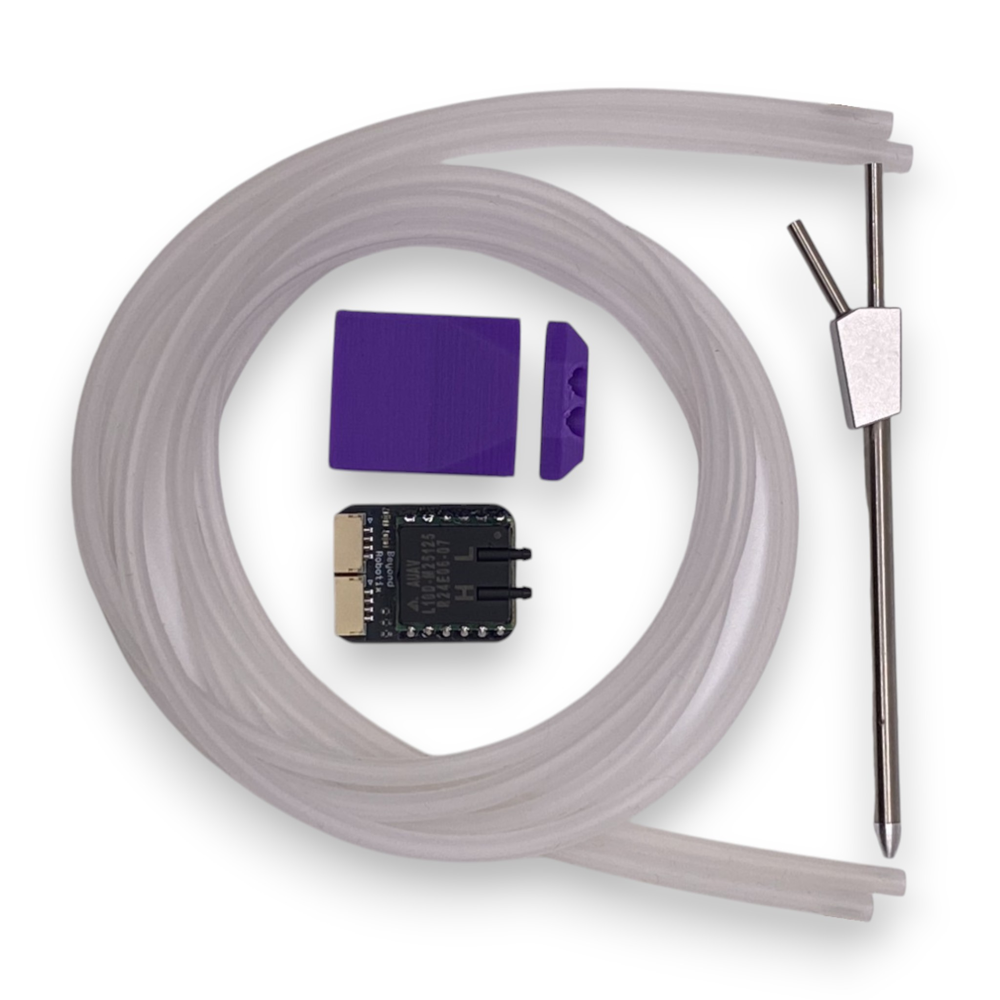

# Beyond Robotix Air Data Module

This is the firmware for our AUAV based combined airspeed and altitude sensor!

Designed to aid fixed wing UAVs in GPS denied environments. Typically, internal barometers on autopilots are affected by pressure changes inside the UAV airframe. By using a static pressure reference from a pitot tube, barometric altitude estimation can be much more accurate. Contact us for more information on how to improve your system in GPS denied environments at admin@beyondrobotix.com

- [Product Page](https://www.beyondrobotix.com/products/air-data-module)
- [Docs page](https://beyond-robotix.gitbook.io/docs/air-data-module)




## Building

This project is built on [Arduino DroneCAN](https://github.com/BeyondRobotix/Arduino-DroneCAN). Board definitions, linker scripts and the bootloader come from the [br_platformio_hwdef](https://github.com/BeyondRobotix/br_platformio_hwdef) platform, and the DroneCAN library is pulled in via `lib_deps` ([libArduinoDroneCAN](https://github.com/BeyondRobotix/libArduinoDroneCAN)), both pinned in `platformio.ini`.

Clone with submodules (for the AUAV sensor driver) and build the `Micro-Node-App` environment:

```
git clone --recurse-submodules https://github.com/BeyondRobotix/AUAV-DroneCAN.git
pio run -e Micro-Node-App
```
